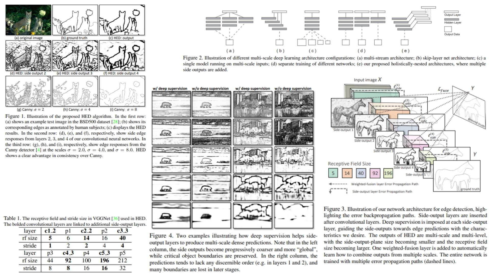

# 🌼 HED Replication – Holistically-Nested Edge Detection

This repository provides a **PyTorch-based replication** of  
**Holistically-Nested Edge Detection (HED) – Learning Deeply Supervised Edge Maps**.

The focus is **understanding side-output supervision and fusion for edge detection**,  
rather than purely maximizing benchmark scores.

- VGG-style backbone with **side outputs** 🐣  
- Deep supervision via **side heads** 🐙  
- Weighted fusion layer learns **holistic edge map** 📧  
- Total loss combines side-output + fusion objectives ✨  

**Paper reference:** [HED – Xie & Tu, 2015](https://arxiv.org/abs/1504.06375) 🌟

---

## 🌌 Overview – HED Architecture



### 🚀 High-level Pipeline

1. **Input image**

```math
X \in \mathbb{R}^{C \times H \times W}
```

2. **Backbone (trimmed VGG)**

```math
F^{(m)} = f(W^{(m)} * F^{(m-1)}), \quad m=1..5
```

3. **Side-output predictions**

```math
\hat{E}^{(m)} = \sigma(C^{(m)}(F^{(m)})), \quad m=1..M
```

4. **Weighted fusion of side outputs**

```math
\hat{E}^{\text{fuse}} = \sigma \Big( \sum_{m=1}^{M} h_m \hat{E}^{(m)} \Big)
```

5. **Total objective**

```math
\mathcal{L}_{\text{total}} = \sum_{m=1}^{M} \alpha_m \mathcal{L}_{\text{side}}(\hat{E}^{(m)}, E_{\text{gt}}) 
+ \mathcal{L}_{\text{fusion}}(\hat{E}^{\text{fuse}}, E_{\text{gt}})
```

---

## 🧠 What the Model Learns

- **Backbone**: hierarchical feature extraction 🌿  
- **Side heads**: supervise intermediate layers → better edge localization 🍬  
- **Sigmoid activation**: produces edge probability maps  
- **Fusion layer**: learns **weighted combination** of side outputs 🎋  
- **Losses**: class-balanced BCE for side outputs + fusion loss 💫  

---

## 📦 Repository Structure

```bash
HED-Replication/
├── src/
│   ├── layers/
│   │   ├── conv_block.py         
│   │   ├── activation.py         
│   │   ├── normalization.py       
│   │   └── pooling.py             
│   │
│   ├── side_outputs/
│   │   ├── side_head.py          
│   │   └── side_utils.py        
│   │
│   ├── fusion/
│   │   └── fusion_head.py         
│   │
│   ├── backbone/
│   │   ├── vgg_blocks.py          
│   │   └── feature_maps.py       
│   │
│   ├── model/
│   │   └── hed_net.py           
│   │
│   ├── loss/
│   │   ├── side_loss.py         
│   │   ├── fusion_loss.py         
│   │   └── total_loss.py         
│   │
│   └── config.py                  
│
├── images/
│   └── figmix.jpg
│
├── requirements.txt
└── README.md
```
---


## 🔗 Feedback

For questions or feedback, contact: [barkin.adiguzel@gmail.com](mailto:barkin.adiguzel@gmail.com)
